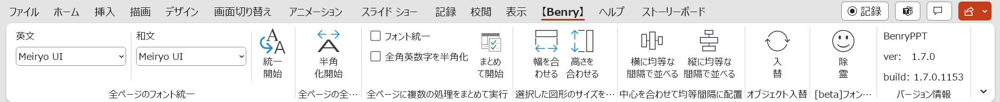
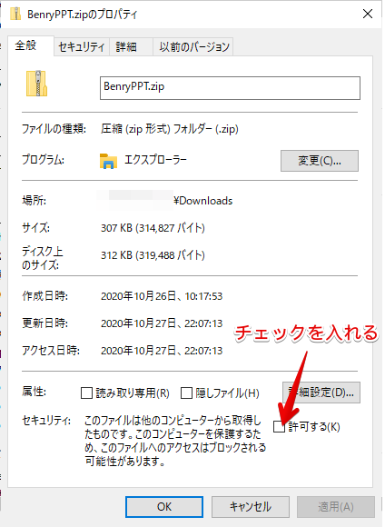

# BenryPPT

## 概要

パワーポイントの拡張機能（VSTOアドイン）です。

### 機能

- 全ページのフォントをまとめて一つのフォントに変更する
- 全ページの全角英数字を半角に変換する
- フォント処理、半角処理を一度にまとめて行う
- サイズを合わせて均等に図形配置する機能
- [beta]フォントエラーで保存できない現象を解決する機能
- バージョン表示

その他気が向いたら機能追加予定。

## 対応環境

Windows 10 Pro 64bitの Office 365で動作確認しています。
その他の環境では保障できません。

## インストール

- PowerPointを終了しておきます。
- [リリースページ](https://github.com/takashyx/BenryPPT/releases) の最新バージョンから、Assetsの項目内にあるBenryPPT.zipファイルをダウンロードしてください。
- BenryPPT.zipファイルはダウンロードしたファイルなので、セキュリティロックがかかっています。これを解除します。
  - BenryPPT.zipファイルを右クリック→「プロパティ」
  - 開いたウィンドウ「全般」タブの一番下の「許可」にチェックを入れる
  - OKを押して終了

  
  - ※参考：[https://artfulplace.hatenablog.com/entry/2014/05/26/154251](https://artfulplace.hatenablog.com/entry/2014/05/26/154251)

- zipファイルを解凍します。
- Setup.exeがありますので実行してください。
- PowerPointを開くと、【Benry】というタブが増えていると思います。

## 更新履歴

|日付|バージョン|更新内容|
|:-:|:-:|:-|
|2022/03/03|v1.6.0|半角変換機能のバグを修正、フォントエラーで保存できない現象を解決する機能を追加|
|2020/11/07|v1.5.0|サイズ変更をレイアウト機能から分離して整理|
|2020/11/01|v1.4.0|図形配置の機能を追加|
|2020/10/31|v1.3.1|フォント統一の英文フォント設定が保存されないバグを修正|
|2020/10/27|v1.3.0|全角英字・数字を半角にする機能を追加し、さらにフォント統一とまとめて一度に処理する機能を追加|
|2020/10/27|v1.2.0|英文と和文のフォントを別々に指定可能に|
|2020/10/25|v1.1.1|簡易的に進捗状況を表示するプログレスバーを追加|
|2020/10/25|v1.1.0| スマートアートやグループ化された図形内の文字に対応|
|2020/10/24|v1.0.0|最初のリリースバージョン|
